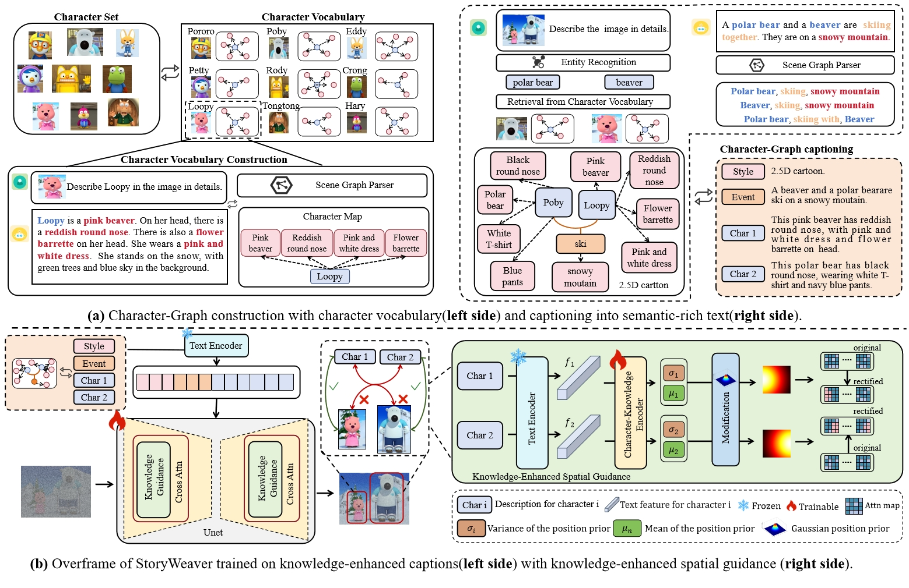

## StoryWeaver: A Unified World Model for Knowledge-Enhanced Story Character Customization


### Abstract

Story visualization has gained increasing attention in artificial intelligence. However, existing methods still struggle with maintaining a balance between character identity preservation and text-semantics alignment, largely due to a lack of detailed semantic modeling of the story scene. To tackle this challenge, we propose a novel knowledge graph, namely Character Graph (\textbf{CG}), which comprehensively represents various story-related knowledge, including the characters, the attributes related to characters, and the relationship between characters.
We then introduce StoryWeaver, an image generator that integrates the Character Graph  for customization (\textbf{CG-C}), aiming to achieve consistent story visualization with rich text semantics. To further improve the multi-character generation performance, we incorporate knowledge-enhanced spatial guidance (\textbf{KE-SG}) into StoryWeaver to precisely inject character semantics into generation. 
To validate the effectiveness of our proposed method, extensive experiments are conducted using a new benchmark called TBC-Bench. The experiments confirm that our StoryWeaver excels not only in creating vivid visual story plots but also in accurately conveying character identities across various scenarios with considerable storage efficiency, \emph{e.g.}, \emph{e.g.}, +10.94\% CLIP-T and +4.81\% CLIP-I on cartoon \emph{Pororo} series. Furthermore, ablation experiments are conducted to verify the superiority of the proposed module.

### Overview




### Getting Start

### Training StoryWeaver

use the shell script,

```
bash train.sh
```

### Sample from StoryWeaver

use the shell script,

```
bash sample.sh
```


### Visual Results

#### Single-Character Story Visualization


#### Multi-Character Story Visualization

